# UI Component Reference

Every React component in `src/` — what it's called, what it does, and a screenshot of it
in the running app where one could be captured. Screenshots were taken against the local
dev server (`npm run dev`, `localhost:5173`) on 2026-08-14.

Some components could not be screenshotted because they're unreachable in the current
build — either gated off by a feature flag, never actually rendered anywhere (dead code
left over from the PropSim fork — see [`docs/PROJECT-CONTEXT.md`](../PROJECT-CONTEXT.md)
for that provenance), or only appear in states this pass didn't trigger (e.g. an error
boundary mid-crash). Those are marked **⛔ not reachable** with a one-line reason instead
of a screenshot.

---

## 1. App shell & bootstrap

| Component | Path | Screenshot | What it does |
|---|---|---|---|
| **App** | `src/App.tsx` | *(whole app)* | Runs the demo-login boot sequence, then mounts `TradingPage`. No router, no login screen — single route. |
| **main (entry)** | `src/main.tsx` | *(whole app)* | Provider stack (React Query, Tooltip, Router), mounts `MarketDataBridge` above `ErrorBoundary` so a crash never kills the tick feed, installs the chunk-load-failure auto-reload handler. |
| **ErrorBoundary** | `src/components/ErrorBoundary.tsx` | ⛔ not reachable | Class-component boundary wrapping `App`. Only renders its fallback UI mid-crash — not naturally triggerable without breaking the app. |
| **MarketDataBridge** | `src/components/MarketDataBridge.tsx` | *(invisible)* | No UI of its own. Subscribes to the WS/bus channels and patches the React Query cache directly — the mechanism the whole live-data UI depends on. |

## 2. Trading page layout

| Component | Path | Screenshot | What it does |
|---|---|---|---|
| **TradingPage** | `src/pages/TradingPage.tsx` | 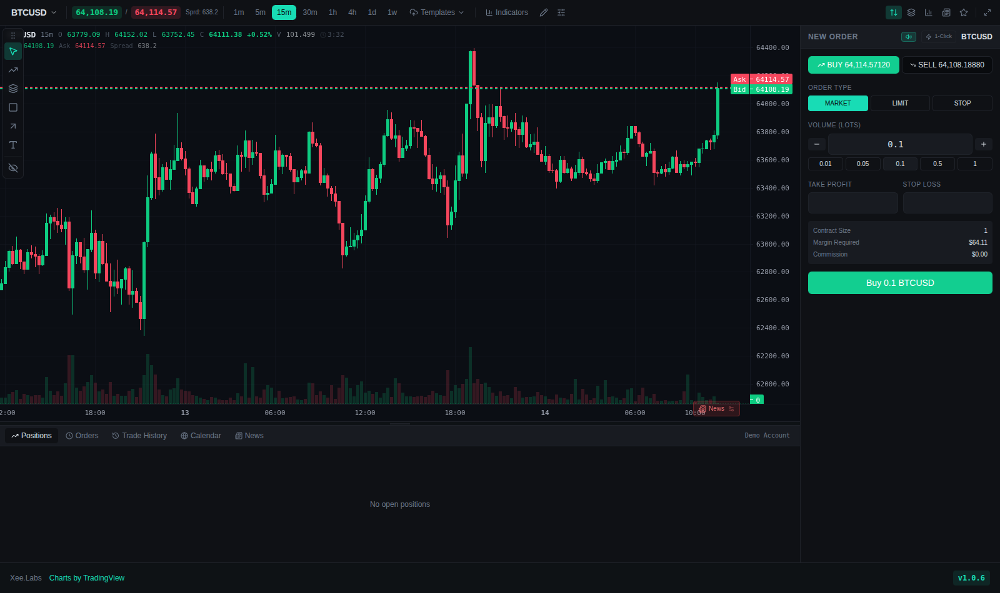 | The terminal shell. Owns UI state (timeframe, active panel, dialogs) and lays out every panel below. |
| **ChartToolbar** | `src/pages/trading/ChartToolbar.tsx` | *(top bar, visible in every screenshot)* | Symbol/timeframe selectors, Templates, Indicators, drawing tools, chart-plugin toggles, right-panel switcher. |
| **Footer** | `src/components/Footer.tsx` | *(bottom bar, visible in every screenshot)* | "Xee.Labs" + TradingView attribution link + version badge. |
| **MarketClosedBanner** | `src/pages/trading/MarketClosedBanner.tsx` | ⛔ not reachable | Banner for closed markets, driven by symbol trading-hours data. The bundled demo symbols are all crypto (24/7), so this condition never fires. |

## 3. Chart & drawing tools

| Component | Path | Screenshot | What it does |
|---|---|---|---|
| **ChartPanel** | `src/pages/trading/ChartPanel.tsx` |  | The 2,140-line chart engine. Creates the `lightweight-charts` instance once per symbol/theme (survives timeframe switches), wires real-time updates, position/order overlays, plugins, and drawing tools. |
| **ChartContextMenu** | `src/pages/trading/ChartContextMenu.tsx` | 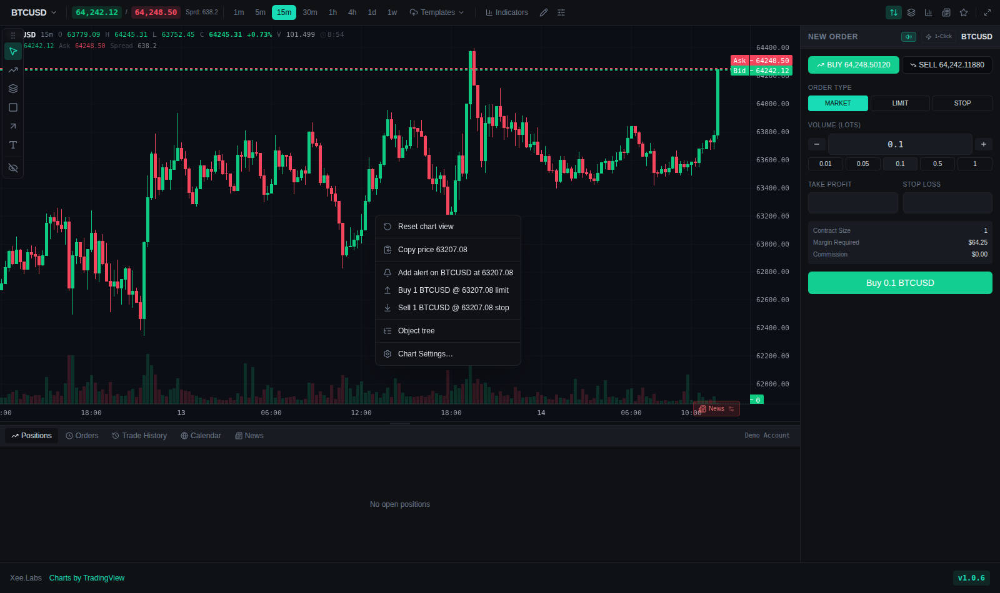 | Right-click menu on the chart: reset view, copy price, add alert, quick buy/sell limit/stop, Object tree, Chart Settings. |
| **ChartSettingsDialog** — Appearance | `src/pages/trading/ChartSettingsDialog.tsx` | 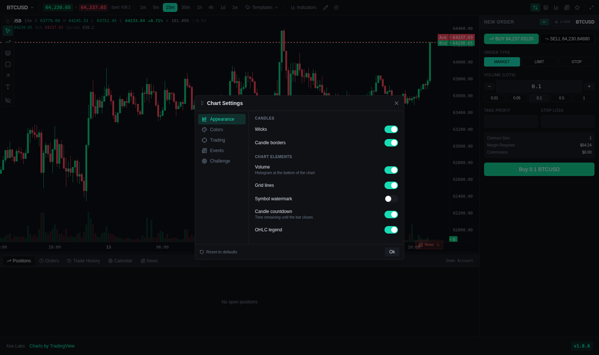 | Candle/grid/watermark/countdown/legend toggles. Opened via the context menu's "Chart Settings…". |
| **ChartSettingsDialog** — Colors | same file | 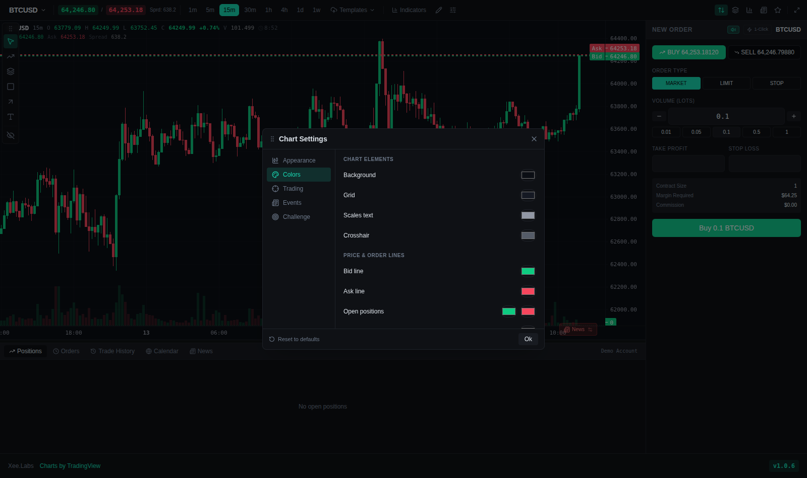 | Color-override tab of the same dialog. |
| **ChartTemplatesMenu** | `src/pages/trading/ChartTemplatesMenu.tsx` | 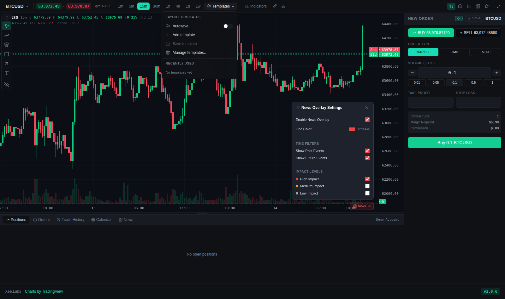 | Save/load/apply named indicator+plugin+drawing presets ("Templates" in the toolbar). |
| **DrawingToolRail** | `src/pages/trading/DrawingToolRail.tsx` | 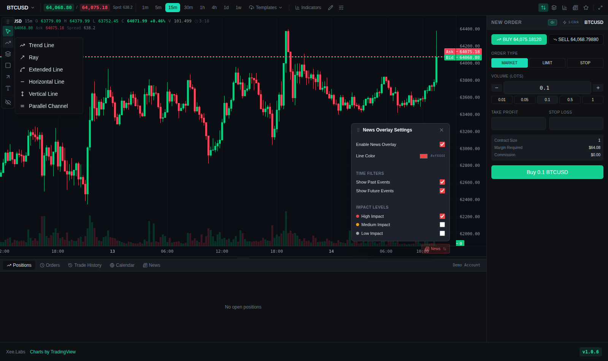 | Vertical icon rail (left edge of chart) — grouped flyouts for trendline/fib/shape/position tool families. |
| **DrawingFloatingToolbar** | `src/pages/trading/DrawingToolsOverlay.tsx` | 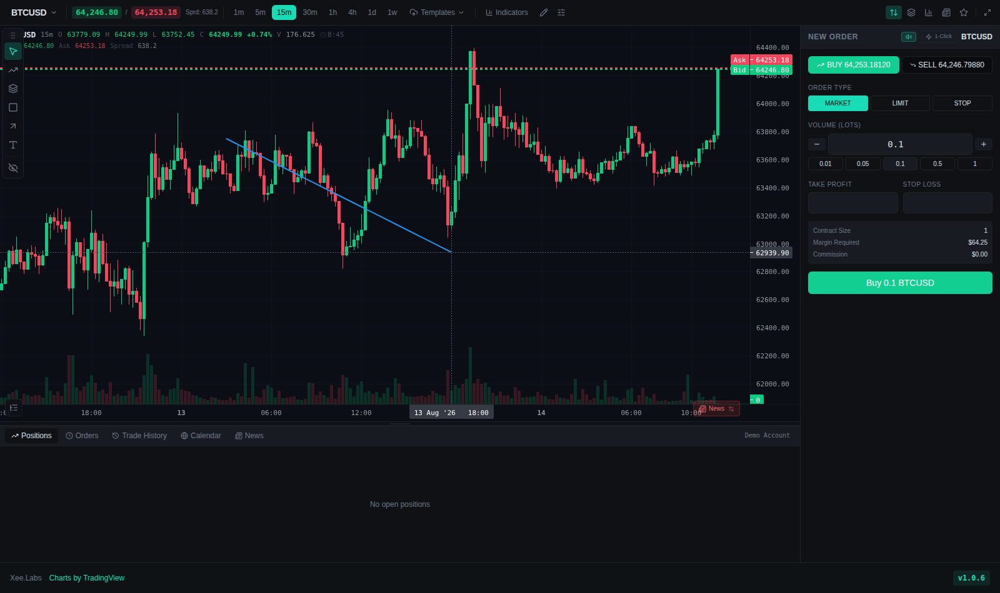 | Style toolbar that appears while a drawing is selected (color/width/line-style). A trendline was drawn on the chart to trigger this. |
| **DrawingSettingsDialog** | same file | ⛔ not captured | Full style editor for a drawing (opened via its context menu) — not reached in this pass. |
| **DrawingContextMenu** | same file | ⛔ not captured | Right-click menu on a placed drawing (delete, lock, alerts, reorder) — not reached in this pass. |
| **ObjectTreePanel** | `src/pages/trading/ObjectTreePanel.tsx` | 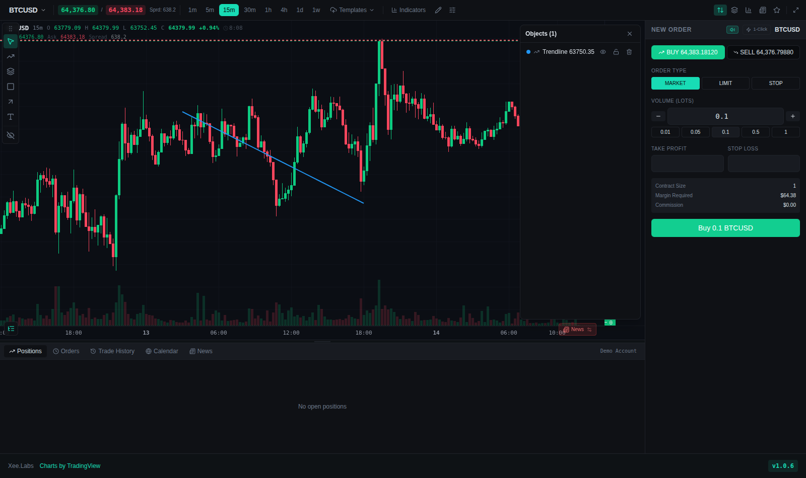 | Lists every drawing on the chart; only rendered once at least one drawing exists. |
| **NewsOverlay** | `src/pages/trading/NewsOverlay.tsx` | *(small "News" pin, visible bottom-right of chart in most screenshots)* | Plots economic-calendar events as pins on the chart timeline; a settings popup (line color, time filters, impact levels) appears when configuring it — visible by accident in `screenshots/15-chart-templates-menu.png`. |
| **ReplayHUD** | `src/pages/trading/ReplayHUD.tsx` | ⛔ not reachable | Playback HUD for session replay — gated off by `REPLAY_ENABLED = false` in `constants.ts`. |
| **ReplayScrubber** | `src/pages/trading/ReplayScrubber.tsx` | ⛔ not reachable | Same gate as above. |
| **Indicators menu** | inline in `ChartToolbar.tsx` | 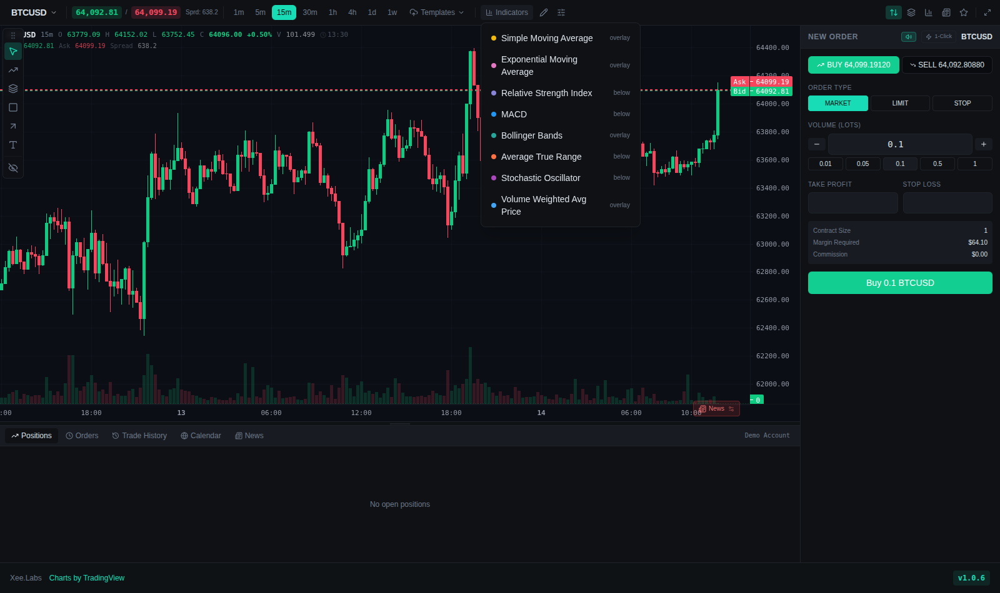 | Picker for SMA/EMA/RSI/MACD/Bollinger/ATR/Stochastic/VWAP overlays. |

## 4. Order & position management

| Component | Path | Screenshot | What it does |
|---|---|---|---|
| **OrderPanel** | `src/pages/trading/OrderPanel.tsx` |  | Market/Limit/Stop order form with TP/SL, live risk analysis (R:R, risk $/%), and margin estimate. Default right-panel view. |
| **DOMPanel** | `src/pages/trading/DOMPanel.tsx` | 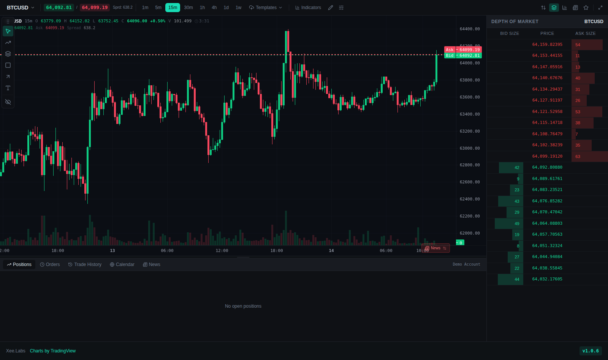 | Depth-of-market ladder. Cosmetic only — bid/ask sizes are randomized, not real order-book data. |
| **WatchlistPanel** | `src/pages/trading/WatchlistPanel.tsx` | 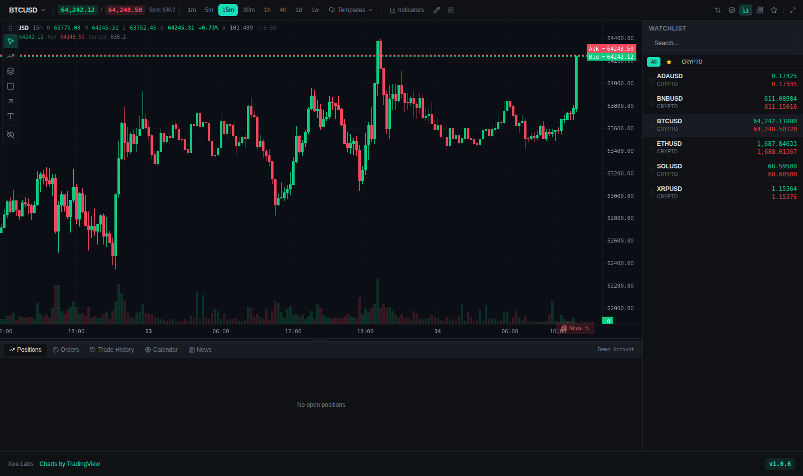 | Live bid/ask list of all demo symbols, favoritable, one-click order placement per row. |
| **BottomPanel** | `src/pages/trading/BottomPanel.tsx` |  | Tabbed dock (Positions/Orders/Trade History/Calendar/News). Owns the close/cancel mutations for the tables it wraps. |
| **PositionsTable** — empty | `src/pages/trading/PositionsTable.tsx` |  | Open-positions list: modify, partial close, close, select-symbol. Pure presentational — mutations live in `BottomPanel`. |
| **PositionsTable** — with a row | same file | 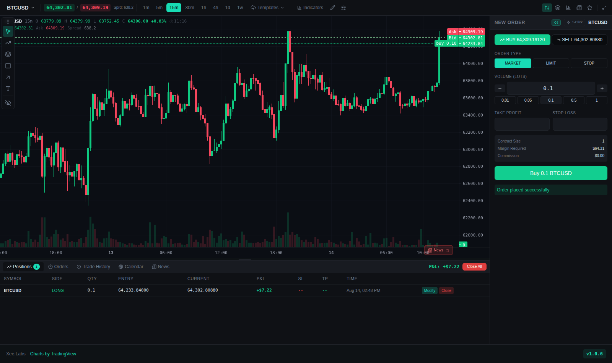 | Same component after a market BUY was placed via the automated capture. |
| **OrdersTable** — empty | `src/pages/trading/OrdersTable.tsx` |  | Pending-orders list: modify, cancel, select-symbol. |
| **OrdersTable** — with a row | same file | 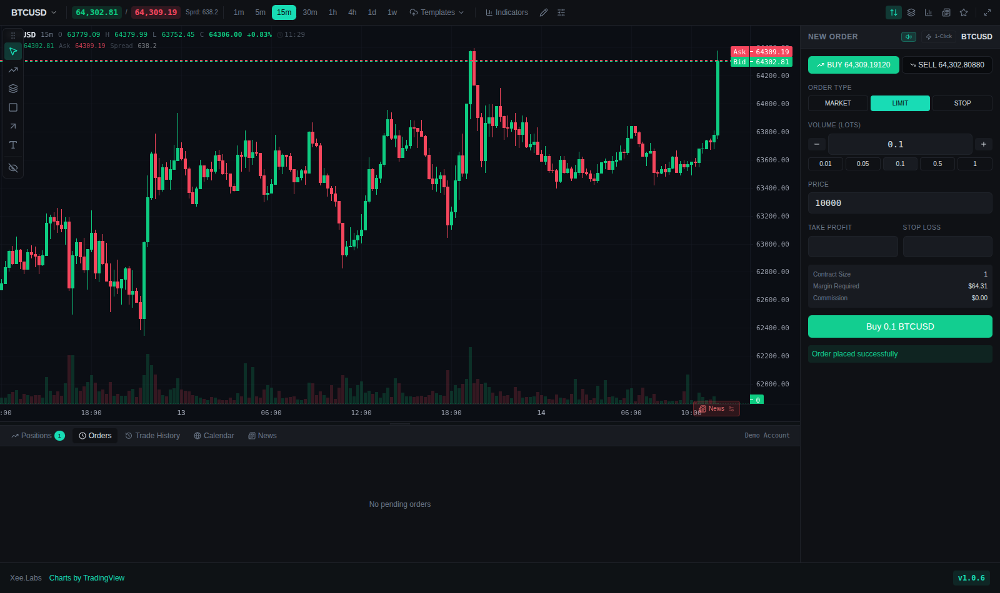 | ⚠️ The row shown here filled **immediately** — the demo engine (`services/demo/engine.ts`) fills LIMIT/STOP orders at the instant price rather than leaving them pending, so this table normally reads "No pending orders" even right after placing a limit order. |
| **Trade History table** | inline in `BottomPanel.tsx` | 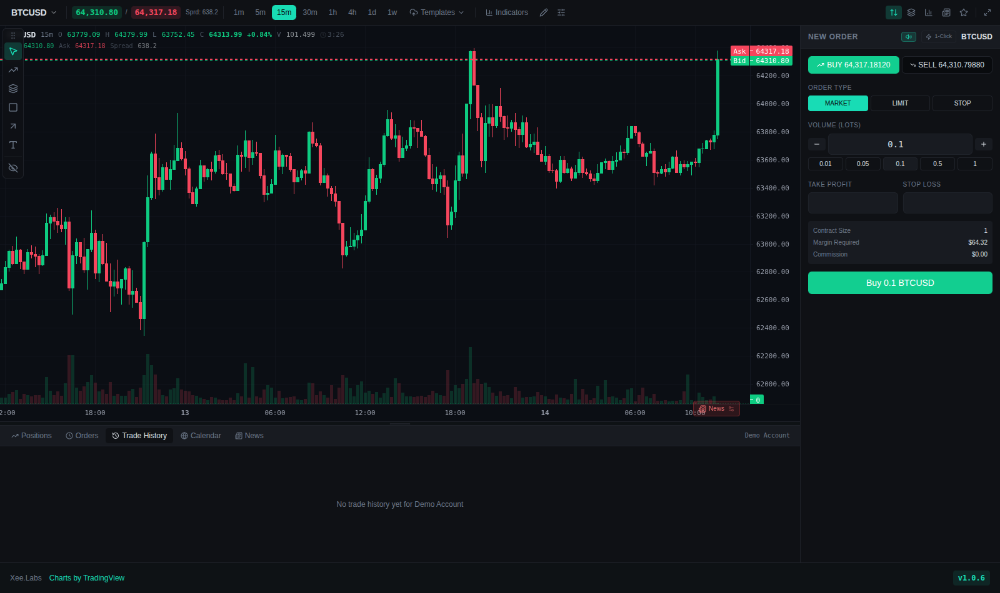 | Closed-trade log for the "Trade History" tab. |
| **EconomicCalendar** (bottom tab) | wraps `TradingViewEconomicCalendar` in `BottomPanel.tsx` | 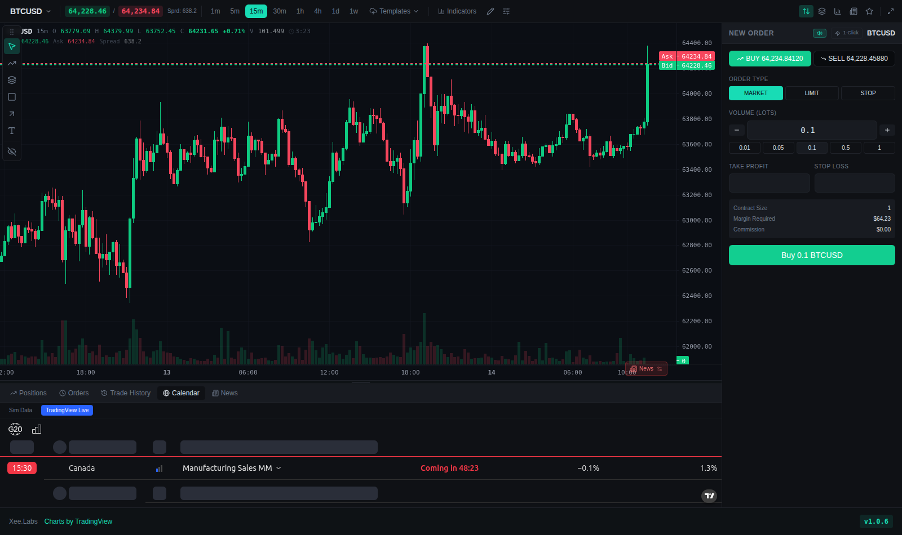 | "Calendar" tab — real TradingView economic-events embed. |
| **NewsFeed** (bottom tab) | `src/components/TradingPowerFeatures.tsx` | 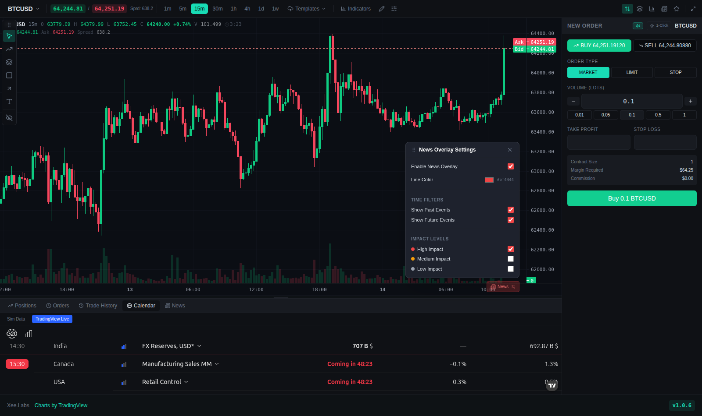 | "News" tab — mock headlines with source/time/impact badges. |
| **TradeJournalPanel** | `src/components/trading-dialogs/TradeJournalPanel.tsx` | ⛔ not reachable | CRUD UI for trade journal entries. The "Journal" bottom-tab that renders it is commented out in `BottomPanel.tsx` ("hidden pending QA"). |

## 5. Dialogs

| Component | Path | Screenshot | What it does |
|---|---|---|---|
| **OrderConfirmDialog** | `src/components/trading-dialogs/OrderConfirmDialog.tsx` | 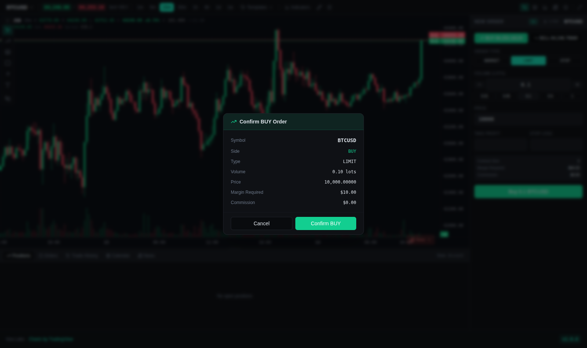 | Confirms a pending order before it's actually submitted. `OrderPanel` and the chart's quick-order flow both always route through this — a stray click can't fill an order. |
| **OrderModifyDialog** | `src/components/trading-dialogs/OrderModifyDialog.tsx` | ⛔ not reachable | Edits a pending order's price/SL/TP. Unreachable in this build for the same reason noted above — orders never stay in a modifiable pending state. |
| **PositionModifyDialog** | `src/components/trading-dialogs/PositionModifyDialog.tsx` | 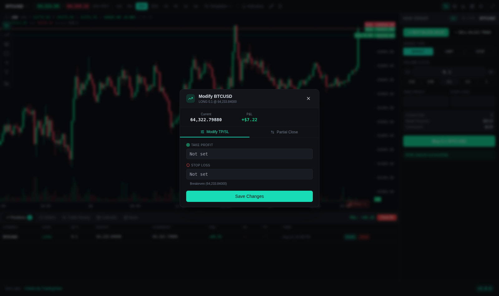 | Edit TP/SL or partially close an open position. |
| **TradeCalculator** | `src/components/trading-dialogs/TradeCalculator.tsx` | ⛔ dead code | Standalone position-size/margin/pip-value calculator. Exported from the `TradingDialogs` barrel but never imported/rendered anywhere in the app. |

## 6. Mobile

| Component | Path | Screenshot | What it does |
|---|---|---|---|
| **MobileAccountBar** | `src/components/MobileTradingPanel.tsx` | 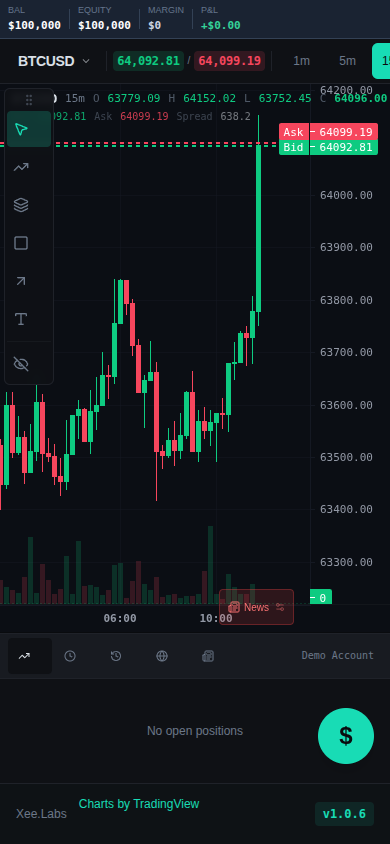 | Balance/equity/margin/P&L strip shown at the top on small screens. |
| **MobileTradingPanel** | same file | 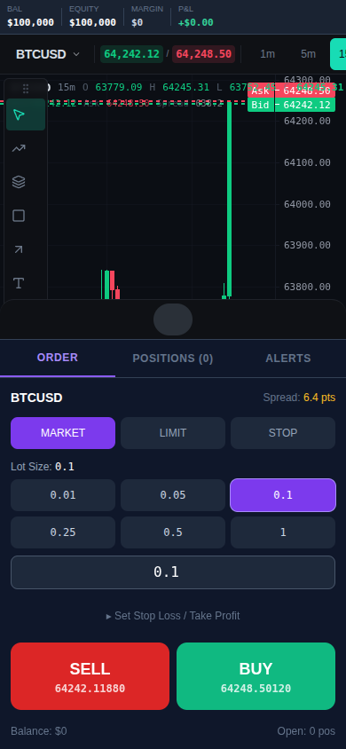 | Touch-optimized order entry (tabs: Order / Positions / Alerts), opened via the floating "$" button. Swipeable between tabs. |
| **MobileSymbolSelector** | same file | ⛔ not captured | Horizontally-scrolling touch symbol picker — not surfaced in the path this pass drove. |

## 7. TradingView embeds

Real third-party widgets from `s3.tradingview.com` — distinct from the `lightweight-charts` engine that powers the main chart.

| Component | Path | Screenshot | What it does |
|---|---|---|---|
| **TradingViewTechnicalAnalysis** | `src/components/TradingViewWidgets.tsx` | 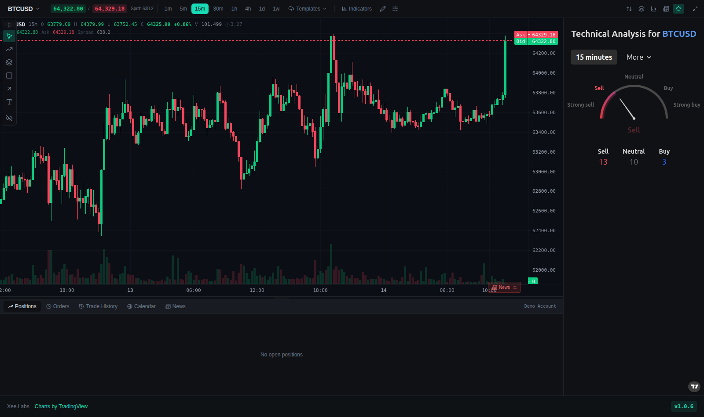 | Buy/sell gauge + oscillator/MA breakdown for the selected symbol. Right-panel "TradingView Analysis" tab. |
| **TradingViewEconomicCalendar** | same file |  | Same embed shown in §4's Calendar tab. |
| **TradingViewTickerTape** | same file | ⛔ dead code | Scrolling ticker-tape strip. Exported but never imported anywhere in the app. |
| **TradingViewMiniChart** | same file | ⛔ dead code | Small sparkline-style symbol overview widget. Exported but never imported anywhere in the app. |

## 8. "Power features" grab-bag

All in `src/components/TradingPowerFeatures.tsx`. `NewsFeed` is live (§4); the rest are built but have no mounting point in the current layout — they read as a features backlog rather than shipped UI.

| Component | Screenshot | What it does |
|---|---|---|
| **PriceAlertManager** | ⛔ not reachable | Set/list price-above/below alerts per symbol, persisted to `localStorage`. |
| **MarketSentimentGauge** | ⛔ not reachable | Buy/sell sentiment bar — deterministic pseudo-random, hashed from the symbol name (not real sentiment data). |
| **MultiSymbolComparison** | ⛔ not reachable | Relative performance bars across a symbol basket — same hashed-mock approach. |
| **TradeSignals** | ⛔ not reachable | Buy/Sell/Neutral "signal" per indicator (RSI, MACD, etc.) — mock, hashed from symbol+indicator name. |
| **RiskOverlay** | ⛔ not reachable | Daily-loss / total-loss budget bars with a SAFE/WARNING/CRITICAL badge. |
| **PnlHeatmap** | ⛔ not reachable | Day × 4-hour-block P&L heatmap grid. |

## 9. Connection / status

| Component | Path | Screenshot | What it does |
|---|---|---|---|
| **DisconnectedTradingBanner** | `src/components/ConnectionIndicator.tsx` | ⛔ not reachable | Shown inside `OrderPanel` when the feed is down. The demo feed is effectively always "up," so this doesn't naturally trigger. |
| **ConnectionIndicator** (visual component) | same file | ⛔ dead code | Connected/connecting/disconnected badge. The *hooks* in this file (`useIsFeedConnected`, `useConnectionState`) are used everywhere; the component itself is never rendered. |
| **StaleDataBanner** | same file | ⛔ dead code | Same story — the `useStaleData` hook has no consumer that renders this banner. |

## 10. UI primitives

Small shadcn/Radix-style building blocks, used throughout every screenshot above rather than standalone.

| Component | Path | What it does |
|---|---|---|
| **Button** | `src/components/ui/button.tsx` | Variants: default, destructive, outline, secondary, ghost, link, plus trading-specific `buy`/`sell`/`success`/`warning`. Sizes default/sm/lg/icon, optional `loading` spinner state. |
| **Card / CardHeader / CardTitle / CardDescription / CardContent / CardFooter** | `src/components/ui/card.tsx` | Bordered container primitives — the shell every "Power feature" card (§8) is built from. |
| **Tooltip / TooltipTrigger / TooltipContent / TooltipProvider** | `src/components/ui/tooltip.tsx` | Radix tooltip wrapper, used for icon-button hints across the toolbar and rail. |

## 11. Gated / stub features

| Component | Path | Screenshot | What it does |
|---|---|---|---|
| **AiTraderPanel / AiTraderPage** | `src/pages/AiTraderPage.tsx` | ⛔ not reachable | Both are stubs that return `null` — "AI trader was a PropSim-specific feature and is not part of Xee.Labs" per the file's own comment. Kept only so the import in `TradingPage` doesn't break. |

---

## Summary

| | Count |
|---|---|
| Total components/exports catalogued | ~58 |
| Screenshotted | 23 states across 21 image files |
| Dead code (exported, never rendered) | 7 — `TradeCalculator`, `ConnectionIndicator`, `StaleDataBanner`, `TradingViewTickerTape`, `TradingViewMiniChart`, and the 6 non-`NewsFeed` "power features" have no mounting point |
| Gated off by a feature flag | `ReplayHUD`, `ReplayScrubber` (`REPLAY_ENABLED = false`), `AiTraderPanel`/`AiTraderPage` (stub) |
| Hidden pending QA | `TradeJournalPanel` (bottom-tab commented out) |
| Structurally unreachable in the demo engine | `OrderModifyDialog` — orders fill instantly rather than staying pending |

See [`docs/architecture/OVERVIEW.md`](../architecture/OVERVIEW.md) for how these components wire into the data layer.
